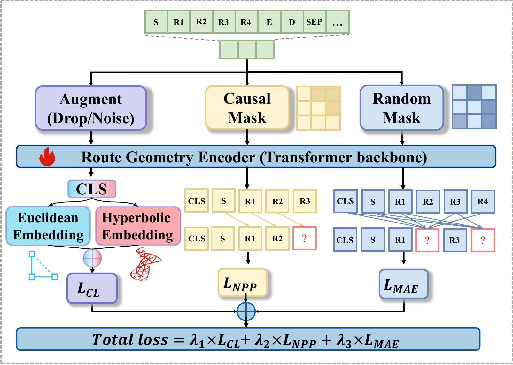
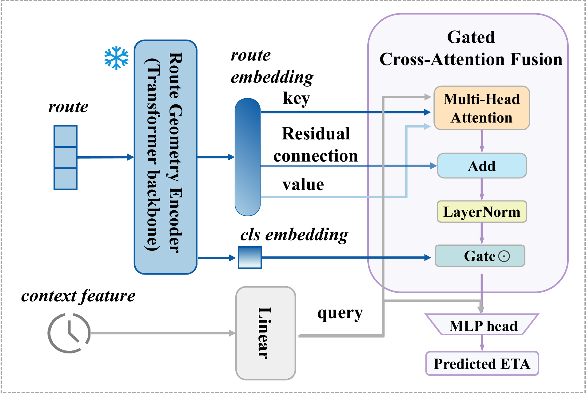

# SHAPE

SHAPE is a Spatial Hyperbolic-Augmented Pretraining framework for ETA prediction on obfuscated or transformed trajectory coordinates. Existing ETA models often rely on raw GPS coordinates, map matching, or road-network attributes, which may be unavailable in privacy-constrained and cross-platform scenarios. SHAPE addresses this setting by learning route representations from differential geometric features and sequential movement patterns.

The framework consists of two stages. First, a route encoder is pre-trained with multi-task self-supervision, including masked autoencoding, next-point prediction, and hybrid Euclidean-hyperbolic contrastive learning. Second, the pre-trained route representations are fused with dynamic context information through gated cross-attention for ETA prediction.

## Framework

The pre-training stage learns ETA-oriented route representations from differential trajectory features.



The fine-tuning stage incorporates dynamic contexts and predicts ETA with a gated cross-attention fusion module.



## Contents

```
reroute_artifact/
├── configs/
│   ├── pretrain_lade.example.yaml
│   └── finetune_lade.example.yaml
├── resources/
│   ├── pretraining_framework.png
│   └── finetuning_framework.png
├── src/
│   ├── trainer/train.py
│   ├── model/model.py
│   ├── loss/cl_loss.py
│   ├── dataprocess/
│   │   ├── preprocess_lade.py
│   │   ├── build_lade_npz.py
│   │   └── TrajectoryContrastiveDataset.py
│   ├── finetune/finetune.py
│   └── utils/
│       ├── experiment_manager.py
│       └── utils.py
├── checkpoints/
│   ├── pretrain/best.pt
│   └── finetune_lade/best_model.pt
└── requirements.txt
```

## Prerequisites

- Python 3.9.13
- PyTorch 2.6.0
- GPU recommended for training

Install dependencies with:

```bash
pip install -r requirements.txt
```

The required packages are PyTorch, NumPy, pandas, PyYAML, tqdm, matplotlib, and scikit-learn. scikit-learn is needed for loading the saved feature scalers used during trajectory augmentation.

## Data Preprocessing

The provided preprocessing scripts are for the LaDe dataset. The pipeline has two steps. First, split the raw courier trajectory dataframe into per-trip trajectory files:

```bash
python src/dataprocess/preprocess_lade.py \
  --input-file data/raw/courier_detailed_trajectory_20s.pkl.xz \
  --output-dir data/interim/trajectory_segments
```

Second, construct the processed `.npz` file and feature scalers:

```bash
python src/dataprocess/build_lade_npz.py \
  --traj-dir data/interim/trajectory_segments \
  --output-dir data/processed/lade
```

This produces `processed_data_lade.npz`, `postman_id_map.pkl`, and the scaler files used by pre-training and fine-tuning.

For Chengdu-G and Porto-G, we follow the processed trajectory data released by the MetaTTE repository and then apply a globally consistent rigid transformation, i.e., one rotation and one translation shared by all trajectories in the corresponding dataset. These controlled transformed-coordinate datasets do not use the LaDe-specific courier preprocessing scripts above.

## Checkpoints

| File | Description |
|------|-------------|
| `checkpoints/pretrain/best.pt` | Pre-trained route encoder  |
| `checkpoints/finetune_lade/best_model.pt` | Fine-tuned ETA model, including encoder, gated fusion, and MLP head |

## Usage

### Pre-training

Copy the example config and edit dataset/scaler paths:

```bash
cp configs/pretrain_lade.example.yaml configs/pretrain_lade.yaml
```

Run pre-training:

```bash
export PYTHONPATH=$(pwd)
python src/trainer/train.py --config configs/pretrain_lade.yaml
```

The best pre-trained encoder is saved as `outputs/<run_id>/models/best.pt`.

### Fine-tuning and Evaluation

Copy the example config and edit dataset paths:

```bash
cp configs/finetune_lade.example.yaml configs/finetune_lade.yaml
```

Run fine-tuning:

```bash
export PYTHONPATH=$(pwd)
python src/finetune/finetune.py --config configs/finetune_lade.yaml
```

The script automatically evaluates the best fine-tuned model on the test set and reports MAE, RMSE, and MAPE.

## Results

The following result is obtained on the LaDe test split using the provided 256-dimensional pre-trained encoder and fine-tuning configuration (`seed=14`).

| Dataset | MAE | RMSE | MAPE |
|---------|-----|------|------|
| LaDe | 69.8869 | 248.5073 | 7.29% |

To reproduce the result, prepare the processed LaDe data, edit `configs/finetune_lade.yaml` from the example config, and run:

```bash
export PYTHONPATH=$(pwd)
python src/finetune/finetune.py --config configs/finetune_lade.yaml
```

## Model Configuration

The provided LaDe checkpoints use:

- `input_dim=7`
- `model_dim=256`
- `num_attn_heads=4`
- `hidden_dim=128`
- `lambda_mae=1.0`
- `lambda_nsp=1.0`
- `lambda_cl=0.5`
